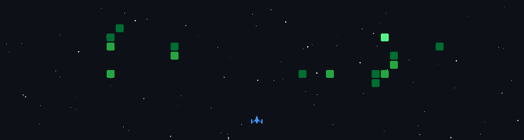

# Hi there, I'm Arvendra Chhonkar! 👋 🚀

I am a B.Tech Mathematics and Computing student with a strong foundation in C, C++, Python, R, MATLAB, and AI/ML. I'm passionate about using technology to solve real-world problems and make a positive impact.  Welcome to my GitHub workspace!

## 🎓 About Me
* **Education:** B.Tech in Mathematics and Computing at Central University of Karnataka (2023–Present).
* **Academics:** Ranked among the top 5 students in my program with a CGPA of 8.2.
* **Leadership:** Proud to serve as the President of the Computing Club and Class Representative, organizing events, hackathons, and leading teams.
* **Experience:** Completed a Web Development Internship at Unified Mentor (Jun '24 - Aug '24), where I completed 5 projects working remotely with a team.

## 🛠️ Tech Stack & Tools
* **Languages:** C++, C, Python, R, Machine Learning, JavaScript, Assembly.
* **Web & Mobile:** NodeJS, React, React Native, Flutter.
* **Tools & Databases:** Git/Github, MySQL, Postman, Jupyter Notebook, RStudio.
* **Math & Simulation:** Matlab, Mathematica.

## 💻 Featured Projects

* **[VCPlayer](link_to_repo):** Developed a C++ based multimedia video player leveraging SDL, FFmpeg, and ImGui for efficient performance and a customizable user interface.
* **[Cancer Detection (Lungs)](link_to_repo):** Developed a deep learning-based cancer type prediction system using a trained CNN model, deployed via Streamlit for real-time image classification with probability visualization.
* **[3-D Art Gallery](link_to_repo):** Built an immersive 3D Art Gallery using Three.js, featuring interactive navigation, smooth camera controls, and dynamic lighting.
* **[Live Chatting Application](link_to_repo):** Developed a real-time chat application using Python sockets with a PyQt5/QtPy-based GUI.

## 👾 My Daily Commits: Space Shooter
*(Watch the spaceship break down my contributions!)*

  

## 📫 Let's Connect!
* **Email:** arvendrachhonkar@gmail.com
